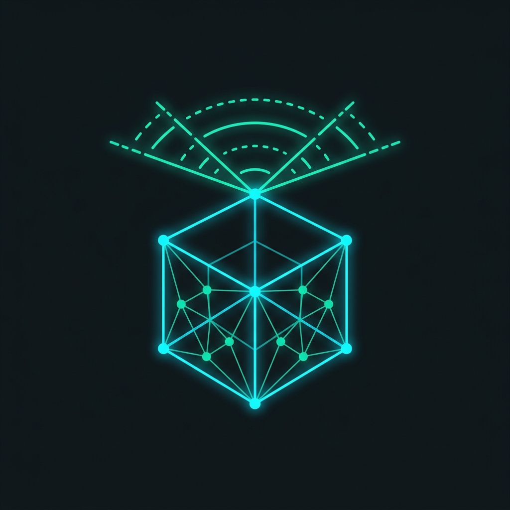

# OpenUSD Edge-to-Core Asset Pipeline & Analytics Showcase

<div align="center">
  
</div>

[](https://www.docker.com/)
[](https://v3alpha.wails.io/)
[](https://openusd.org/)
[](https://go.dev/)
[](https://www.python.org/)

Processing pipeline designed for mobile mapping and reality capture telemetry, leveraging Go, Python, and NVIDIA Omniverse technologies (OpenUSD + RTX Neural Texture Compression).

---

## Architecture Overview

* **Edge Acquisition**: Mobile LiDAR SLAM & High-Resolution Photogrammetry (Reality Capture).
* **Control Layer (Backend)**: Asynchronous, stream-based Go server using gRPC and NATS for orchestration.
* **Processing Layer (Worker)**: Headless Python gRPC services leveraging NVIDIA OpenUSD libraries and RTX Neural Texture Compression (NTC) for optimized memory utilization.
* **Analysis & Visualization**: Desktop analytics environment built with Wails, featuring geometric measurements, telemetry dashboards, and local LLM-assisted reporting (Google Gemma).

---

## Project Structure

```text
.
├── nequ3d-app/     # Desktop app (Wails frontend) & Go Orchestrator backend
├── nequ3d-core/    # OpenUSD processing scripts, Python gRPC server & RTX NTC pipeline
├── data/           # Raw and optimized spatial assets (gitignored)
└── docs/           # Engineering thesis and technical documentation
```

---

## What Is It?


The platform transforms raw reality-capture datasets into optimized OpenUSD scenes suitable for visualization, analytics, and long-term archival.

The processing workflow enables:

* Automated ingestion of LiDAR and photogrammetry assets
* OpenUSD scene generation and manipulation
* Neural texture compression using NVIDIA RTX NTC
* Telemetry collection and performance monitoring
* Desktop-based geometry inspection and measurement
* AI-assisted report generation using local LLM inference

---

# Prerequisites

Before running the system, install the required tooling.

## Task
We use [Taskfile](https://taskfile.dev/) to manage build and development commands.

### Installation
https://taskfile.dev/installation/

---

## Ollama (Local LLM Engine)

To enable the AI-assisted telemetry analysis and reporting, you must install Ollama and pull the required models to your local machine.

### Installation

https://ollama.com/download

After installing Ollama, pull the models used by the application (you can choose which ones to use in the UI):

```bash
ollama pull gemma2
ollama pull llama3
ollama pull mistral
ollama pull llava
```

Verify your installation by ensuring the Ollama service is running on port `11434`.

---

## Docker

Docker is used to build and execute the isolated OpenUSD processing environment.

### Installation

https://www.docker.com/products/docker-desktop/

---

## Wails v3

Wails powers the native desktop analytics application.

### Installation

https://v3alpha.wails.io/getting-started/installation/

---

# Quick Start & Running the Application

The project uses a unified `Taskfile.yml` to simplify running the system.

### 1. Build and Run the Wails Development Environment

In your main terminal, run:
```bash
task dev
```
This command automatically:
* Generates gRPC protobuf files.
* Builds the Docker image for the processing core (`nequ3d-core:latest`).
* Generates Wails bindings and starts the frontend.

### 2. Start the Processing (gRPC) Server

Open a **new, separate terminal**, and run:
```bash
task run-core
```
This starts the Python gRPC server (listening on port 50051) which handles the OpenUSD manipulation and RTX NTC processing tasks sent by the Wails app.

---

# Technology Stack

| Layer            | Technology     |
| ---------------- | -------------- |
| Backend          | Go             |
| RPC / Messaging  | gRPC & NATS    |
| Processing       | Python         |
| Scene Format     | OpenUSD        |
| Compression      | NVIDIA RTX NTC |
| Desktop UI       | Wails          |
| AI Reporting     | Google Gemma   |
| Containerization | Docker         |

---

# Future Roadmap

* Distributed processing workers
* Kubernetes deployment support
* Cloud object storage integration
* Live telemetry streaming
* Web-based analytics dashboard
* Collaborative OpenUSD scene review
* AI-assisted anomaly detection

---

# License

This project is intended for research, engineering, and educational purposes.
